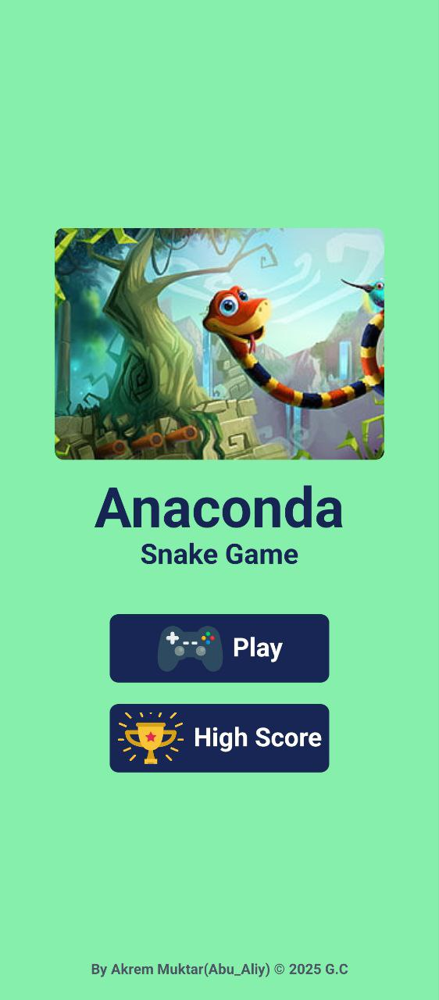

# Anaconda Snake Game

A classic Snake game built with **React Native** using Expo. The game allows you to control the snake to collect food, grow in size, and avoid hitting walls or your own tail. It includes difficulty levels, score tracking, and high score functionality.

## Features

- **Classic Snake Gameplay**: Control the snake with a virtual joystick to collect food and grow.
- **Difficulty Levels**: Choose between Easy, Medium, and Hard difficulties that affect the speed of the game.
- **High Score Tracking**: Stores the highest score achieved during the game.
- **Joystick Controller**: Use a virtual analog joystick to control the snake's direction.

## Installation

1. **Clone the repository**:

    ```bash
    git clone https://github.com/yourusername/snake-game.git
    ```

2. **Navigate into the project directory**:

    ```bash
    cd snake-game
    ```

3. **Install dependencies**:

   If you're using **npm**:

    ```bash
    npm install
    ```

   Or if you're using **yarn**:

    ```bash
    yarn install
    ```

4. **Start the app**:

   To run the app on your local machine, use Expo:

    ```bash
    npx expo start
    ```

   This will open a browser window with a QR code. Scan the QR code with the **Expo Go** app on your phone to start playing.

## Game Controls

- **Joystick**: Move the snake using the on-screen joystick. The joystick allows you to control the snake's movement in all directions (up, down, left, right).
- **Pause/Reset**: When the game is over, you can restart the game or change the difficulty.

## Screenshots



## Contributing

Feel free to open issues or submit pull requests to improve the game. Contributions are welcome!

# 👉🏻 [Download the game](https://expo.dev/artifacts/eas/gcJDrV29o8yraEYyBe4wBU.apk)
